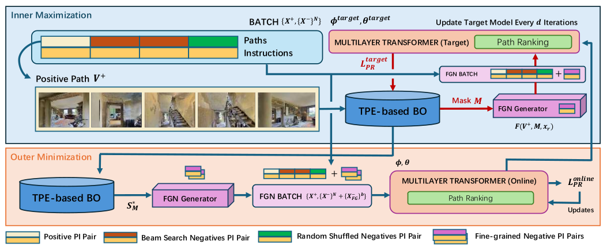

# FGVLN - Fine-grained Vision-and-Language Navigation via Bayesian Optimization





Official Implementation of FGVLN on CoRL 2024. Draft version.

Contents : [Installation](#install) | [Data Download](#data) | [Training & Evaluating Discriminative](#discri) | [Training & Evaluating Generative](#gene) | [Model Zoos](#models)


## Installation <h2 name="install" style="display:none;"> </h2>

This project is developed with Python 3.6.13, Pytorch 1.10.1. Please install dependencies by follows:

```
conda env create -f env.yaml
conda activate fgvln
```

Information about the dependencies are also provided in *requirements.txt*.

## Download Dataset <h2 name="data" style="display:none;"> </h2>

1. Download the checkpoint of VilBERT pre-trained on [Conceptual Captions](https://dl.fbaipublicfiles.com/vilbert-multi-task/pretrained_model.bin) and then put it into *data/*.

<!-- *data/pretrained_model.bin* -->

2. Download the [matterport-ResNet-101-faster-rcnn features](https://dl.dropbox.com/s/67k2vjgyjqel6og/matterport-ResNet-101-faster-rcnn-genome.lmdb.zip) and unzip it and then put it into *data/*.

3. Download the [instruction template](https://drive.google.com/file/d/1skdU4Kvs3E1jvqBSBvtsLsxMXYbtQ7fp/view?usp=sharing) and then put it into *data/task*.

4. Follow [download.py](scripts/download.py) to download the other data of tasks.
```bash
python scripts/download.py
```

5. Download [model](https://drive.google.com/file/d/1reRM3yKULDEHuxamcmx0enn9fh147rWs/view?usp=sharing) pretrained on upstream YoutubeVLN task, and put it into *data/trained/pretrain_lily_new.bin*.

6. There are 3 files you need to download mannuly again:

    [data/config/bert_base_6_layer_6_connect.json](https://drive.google.com/uc?id=17mL0qCWnIjqL2GNku8A7CKAi6A8Scogh)

    [data/task/aug+R2R_train.json](https://drive.google.com/uc?id=1cA2GRF_EGB8cw_XIxk8b6TXSEaWZEDk7)

    [data/beamsearch/aug_beams_train.json](https://drive.google.com/uc?id=1ukpTRI6LelEl0_gk10azW_Td95XANL2e)


The final file structure should looks like the following:

```
data/
  beamsearch/
  config/
  connectivity/
  distances/
  matterport-ResNet-101-faster-rcnn-genome.lmdb
  task/
  trained/
  pretrained_model.bin
```


## Training & Evaluating Downstream Tasks (Discriminative) <h2 name="discri" style="display:none;"> </h2>

### Training with MLM and MVM Losses

```
CUDA_VISIBLE_DEVICES=0,1,2,3 python -m torch.distributed.launch \
    --nproc_per_node 4 \
    --master_port 5558 \
    -m train \
    --from_pretrained data/trained/pretrain_lily_new.bin \
    --save_name yresult/FGvln_1phase \
    --masked_vision \
    --masked_language \
    --batch_size 12 \
    --num_epochs 30
```


### Training with PR Loss

Training FGVLN with BO-based FGN sampler to generate 2 additional FGN in each batch, and 5 optimization iterations:

```
CUDA_VISIBLE_DEVICES=0,1,2,3,4,5,6,7 python -m torch.distributed.launch  \
    --nproc_per_node 8   \
    --master_port 5558   \
    -m train   \
    --from_pretrained result/FGvln_1phase/data/29.bin \
    --save_name FGvln_1e5_2FG_5it   \
    --shuffle_visual_features   \
    --ranking   \
    --batch_size 16    \
    --num_epochs 30 \
    --FGN \
    --trial_type 1 \
    --num_FGN 2 \
    --trial_iter 5
```

You could adjust the BO configurations by passing different cml parameters, please refer to `utils/cli.py` for more details.

### Testing

```
CUDA_VISIBLE_DEVICES=0 python test.py \
  --from_pretrained <trained .bin file> \
  --save_name results/fgvln_testing \
  --split val_unseen

python scripts/calculate-metrics.py results/fgvln_testing/test_val_unseen/_results_val_unseen.json
```


## Training & Evaluating on Generative Task <h2 name="gene" style="display:none;"> </h2>


Training generative FGVLN requires MP3D simulator, please follow the instructions provided in [airbert-recurrent](https://github.com/airbert-vln/airbert-recurrentvln) to setup the environment and download the data.

To reproduce our result, simply replace the airbert model with our FGVLN model.

## Model Zoos <h2 name="models" style="display:none;"> </h2>

The models will be shared after paper acception to ensure not violating anonymity.